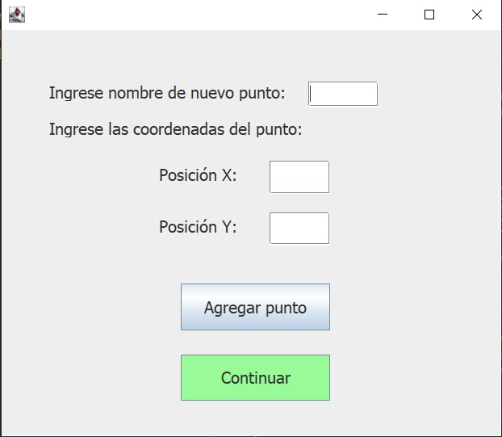
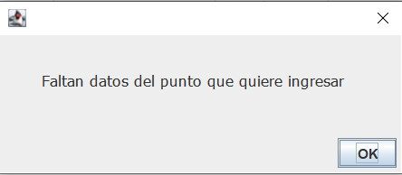
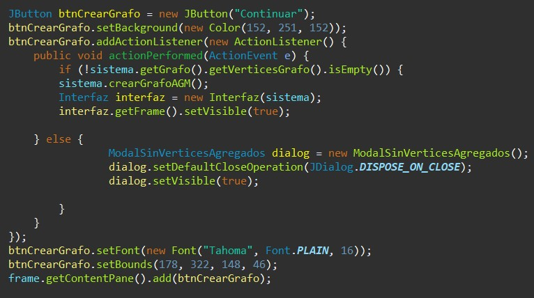

= Trabajo práctico 2
== Segundo Semestre 2022
 
*Integrantes*

Mendez Agustina <agustina.996@hotmail.com>,
Leandro Matias Avila

*Docentes*

* Patricia Bagnes
* Javier Marenco

== Introducción

El objetivo del trabajo práctico es implementar una aplicación para realizar clustering utilizando el algoritmo propuesto por Charles Zahn en el artículo “Graph-theoretical methods for detecting and describing clusters” (IEEE Transactions on Computers 20-1, 1971). Dado un conjunto de puntos en el plano y un grafo completo con estos puntos y con pesos en las aristas iguales a la distancia euclídea entre los vértices, el algoritmo es el siguiente: 

* Calcular un árbol generador mínimo del grafo.
* Eliminar del árbol las aristas cuyos pesos sean mayores que los pesos de sus aristas vecinas. 

El sistema cuenta con una interfaz visual donde el usuario ingresa de manera manual: el nombre del vértice y sus coordenadas (x, y).

Si falta algún dato del punto ingresado, se muestra una ventana de dialogo para advertir al usuario.

Una vez agregados los puntos, el usuario debe oprimir el boton continuar. Este botón llama al metodo del sistema crearGrafoAGM() que a su vez, llama al metodo grafo.CrearGrafo() que crea el grafo completo. A partir de ese grafo completo, se lo transforma en un AGM con la llamada al metodo grafo.transformarArbolGeneradorMinimo().

El boton continuar tambien crea una nueva interfaz donde el usuario ingresara la cantidad de clusters en los que quiere dividir el grafo.

image::src/img4.JPG[]

Al oprimir el boton listo, si la cantidad de divisiones que se quieren hacer es mayor a la cantidad de puntos ingresados, se mostrara una ventana de aviso para que se cambie el valor.

image::src/img5.JPG[]

Si el valor ingresado es correcto, se hace la llamada al metodo sistema.generarClusters(). 

[source, java]
----
JButton btnNewButton = new JButton("LISTO");
		btnNewButton.addActionListener(new ActionListener() {
			public void actionPerformed(ActionEvent e) {
				if (sistema.getGrafo().getVerticesGrafo().size() >= Integer.parseInt(textFieldCantClusters.getText())) {
					sistema.generarClusters(Integer.parseInt(textFieldCantClusters.getText()));
					InterfazResultado interfaz = new InterfazResultado(sistema);
					interfaz.getFrame().setVisible(true);
				} else {
					ModalCantidadDeClusters dialog = new ModalCantidadDeClusters(
							sistema.getGrafo().getVerticesGrafo().size(),
							Integer.parseInt(textFieldCantClusters.getText()));
					dialog.setDefaultCloseOperation(JDialog.DISPOSE_ON_CLOSE);
					dialog.setVisible(true);
					textFieldCantClusters.setText("");

				}
			}
		});
		btnNewButton.setFont(new Font("Tahoma", Font.PLAIN, 16));
		btnNewButton.setBounds(164, 144, 121, 30);
		getFrame().getContentPane().add(btnNewButton);
----

sistema.generarClusters()  llama a grafo.generarClusters(cantidad). Este metodo es el encargado de buscar las cantidad – 1 aristas (siendo cantidad el número ingresado por el usuario) de mayor peso y eliminarlas hasta obtener la cantidad de componentes necesarias.

[source, java]
----
public void generarClusters(Integer cantidad) {
		int contador = 0;
		while(cantidad - 1 > contador) {
			int indiceAristaMax = 0;
			for (int i = 0; i < listaAristas.size(); i++) {
				if (listaAristas.get(i).getPeso() > listaAristas.get(indiceAristaMax).getPeso()) {
					indiceAristaMax = i;
				}
			}
			eliminarArista(indiceAristaMax);
			contador++;
		}
	}
----
El boton listo, tambien abre la ventana donde se muestra el resultado final. Aca se puede observar gráficamente los puntos y las aristas de los clusters.
Para dibujar los vértices, utilizamos Panel de 10x10 y agregamos el nombre de cada vértice.

[source, java]
----
private void dibujarVertices() {
		for(Vertice vertice: sistema.getGrafo().getVerticesGrafo()) {
			dibujarVertice(vertice);
		}
	}

	private void dibujarVertice(Vertice vertice) {
		Panel panel = new Panel();
		panel.setBackground(Color.BLACK);
		panel.setBounds(vertice.getcoordenadaVertice().x*10, vertice.getcoordenadaVertice().y*10, 10, 10);
		frmResultado.getContentPane().add(panel);
		
		JLabel nombreVertice = new JLabel(vertice.getNombre());
		nombreVertice.setFont(new Font("Tahoma", Font.PLAIN, 10));
		nombreVertice.setBounds(vertice.getcoordenadaVertice().x*10 + 15, vertice.getcoordenadaVertice().y*10 + 5, 30, 30);
		frmResultado.getContentPane().add(nombreVertice);
		
		String coordenada = "(" + vertice.getcoordenadaVertice().x + "," + vertice.getcoordenadaVertice().y + ")";
		JLabel coordenadaVertice = new JLabel((coordenada));
		coordenadaVertice.setFont(new Font("Tahoma", Font.PLAIN, 10));
		coordenadaVertice.setBounds(vertice.getcoordenadaVertice().x*10 + 25, vertice.getcoordenadaVertice().y*10 + 5, 40, 40);
		frmResultado.getContentPane().add(coordenadaVertice);
	}
----

Para dibujar las aristas utilizamos JSeparator para formar una línea a partir de puntos. En un primer momento, para dibujar cada punto, nos movimos una posición en x y otra en y. Esto generaba que una vez alcanzado el valor de una de las coordenadas, se siguiera moviendo solo en x o en y hasta alcanzar la posición del segundo vértice.

image::src/img6.JPG[]

Para que se vea mejor visualmente, se consideró obtener un porcentaje de movimiento para x y un porcentaje para y.

[source,java]
----
private void dibujarAristas() {
		for(Arista arista: sistema.getGrafo().getListaAristas()) {
			dibujarArista(arista);
		}
	}

	private void dibujarArista(Arista arista) {
		// Dejamos en coorX la coordenada que esta mas a la izquierda
		int coorX = 5;
		int coorXDestino = 5;
		int coorY = 5;
		int coorYDestino = 5;
		if (arista.getCoordenada1().x*10 < arista.getCoordenada2().x*10) {
			coorX += arista.getCoordenada1().x*10;
			coorY += arista.getCoordenada1().y*10;
			coorXDestino += arista.getCoordenada2().x*10;
			coorYDestino += arista.getCoordenada2().y*10;
		} else {
			coorX += arista.getCoordenada2().x*10;
			coorY += arista.getCoordenada2().y*10;
			coorXDestino += arista.getCoordenada1().x*10;
			coorYDestino += arista.getCoordenada1().y*10;
		}
		
		double difX = coorXDestino - coorX;
		double difY = (coorY < coorYDestino) ? coorYDestino - coorY : coorY - coorYDestino;
		double porcentajeDeAumentoParaX = difX / difY;
		double porcentajeDeAumentoParaY = difY / difX;
		double contadorAumentoX = porcentajeDeAumentoParaX;
		double contadorAumentoY = porcentajeDeAumentoParaY;
		
		while(coorX != coorXDestino || coorY != coorYDestino) {
			JSeparator separator = new JSeparator();
			separator.setBounds(coorX, coorY, 1, 1);
			separator.setForeground(Color.BLACK);
			separator.setBackground(Color.BLACK);
			frmResultado.getContentPane().add(separator);
			if (porcentajeDeAumentoParaX < porcentajeDeAumentoParaY) {
				if (contadorAumentoX >= 1){
					coorX++;
					contadorAumentoX--;
				}
				contadorAumentoX += porcentajeDeAumentoParaX;
				if (coorY < coorYDestino) {
					coorY++;
				} else if (coorY > coorYDestino) {
					coorY--;
				}
			} else if (porcentajeDeAumentoParaX > porcentajeDeAumentoParaY) {
				if (contadorAumentoY >= 1){
					if (coorY < coorYDestino) {
						coorY++;
					} else if (coorY > coorYDestino) {
						coorY--;
					}
					contadorAumentoY--;
				}
				contadorAumentoY += porcentajeDeAumentoParaY;
				if (coorX != coorXDestino) {
					coorX++;
				}
			} else {
				coorX++;
				if (coorY < coorYDestino) {
					coorY++;
				} else if (coorY > coorYDestino) {
					coorY--;
				}
			}
		}
	}

----
De esta manera logramos que las líneas se vean más parejas y que no haya “esquinas” que se puedan confundir con otros vértices.
image::src/img7.JPG[]
